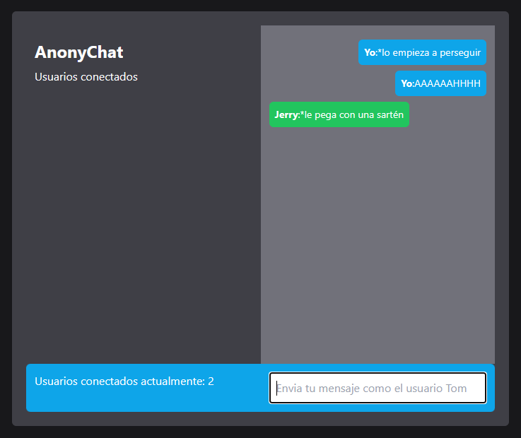

## React Nodejs Socket.io

Un ejemplo simple de React usando NodeJs como stack backend, junto con la tecnología Socket.io.
Tailwind se uso cómo librería de estilos.

## Herramientas usadas

React como tecnología front.
Socket.io para realizar las conexiones.
Express como framework backend.
Node.JS como entorno de ejecución de Javascript.